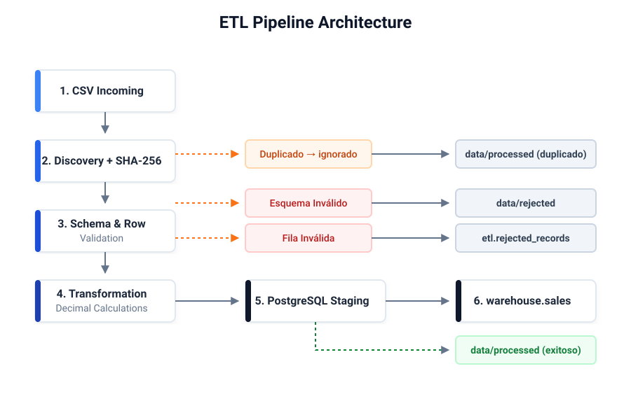
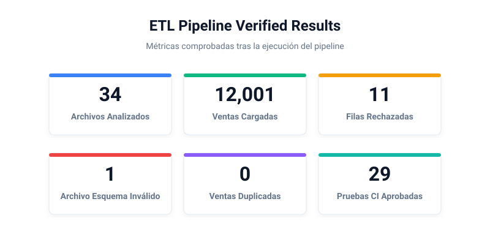

# Python ETL Automation Pipeline

Automated CSV validation, transformation and transactional loading into PostgreSQL.

## 1. Resumen Ejecutivo
Este proyecto es un pipeline ETL empresarial construido en Python. Automatiza el descubrimiento, validación estricta, cálculos financieros precisos y la carga transaccional hacia un Data Warehouse centralizado en PostgreSQL, erradicando inconsistencias y garantizando integridad total.

## 2. El Problema Empresarial
Las operaciones diarias de recolección de ventas sufren típicamente de:
- **Consolidación manual de archivos:** Pérdida de tiempo valioso reuniendo docenas de CSVs dispersos.
- **Errores de estructura y calidad:** Datos mal formateados, tipos incorrectos (strings en vez de números) o valores nulos.
- **Duplicación de ventas:** Archivos que se cargan más de una vez por error humano, inflando métricas.
- **Falta de trazabilidad:** Imposibilidad de saber qué archivo originó qué fila de datos ante una auditoría.

## 3. Solución Implementada
Un proceso *cero-intervención* que monitoriza, encripta y consolida archivos automáticamente. Usando una arquitectura transaccional de dos fases y validación estática, el sistema decide autónomamente qué datos son aptos para la analítica y cuáles deben ser segregados por calidad, notificando su estado final.

## 4. Arquitectura Visual



## 5. Resultados Comprobados (Demostración de Estrés)



- **34 CSV detectados** en los directorios entrantes.
- **12,001 ventas válidas cargadas** hacia el Data Warehouse con éxito.
- **11 filas físicamente rechazadas** debido a reglas de negocio estrictas.
- **1 archivo rechazado por esquema** debido a estructura corrupta.
- **Duplicados detectados mediante SHA-256** impidiendo el re-procesamiento.
- **0 `sale_id` duplicados** en PostgreSQL, previniendo falsos positivos.
- **29 pruebas automatizadas** en el framework Pytest (100% de pase).
- **Ruff sin observaciones**, garantizando limpieza absoluta del código.

## 6. Características Principales
- **Descubrimiento Autónomo:** Búsqueda dinámica de archivos con extensión CSV.
- **Criptografía (SHA-256):** Prevención de archivos duplicados silenciosos.
- **Validación Estricta:** Uso intensivo de `Pydantic` para tipado y aserciones lógicas.
- **Transformación Financiera:** Manejo preciso usando la librería nativa `Decimal` con redondeo bancario (HALF-UP).
- **PostgreSQL Staging y COPY:** Inserciones ultra-rápidas en bloque mediante tablas temporales.
- **ON CONFLICT:** Prevención de colisiones de Primary Key a nivel de Base de Datos.
- **Rollback y Compensación:** Total paridad ACID entre PostgreSQL y el File System.
- **Logging Operativo:** Rotación de archivos de bitácora centralizados.
- **Advisory Lock (`pg_try_advisory_lock`):** Prevención nativa de concurrencia y carrera de condiciones.
- **Task Scheduler Integrado:** Envoltorios profesionales de PowerShell para automatización en Windows.
- **Integración Continua:** GitHub Actions pre-configurado para ejecutar CI/CD en ambientes efímeros `ubuntu-latest`.

## 7. Tecnologías
- **Core:** Python 3.13, PowerShell 7+
- **Data Engineering:** Psycopg 3, PostgreSQL 18.6
- **Validación & Config:** Pydantic 2.x, Pydantic-Settings
- **Calidad de Software:** Pytest, Ruff, GitHub Actions CI

## 8. Estructura de Carpetas

```text
.
├── .github/workflows/    # CI Pipeline (quality.yml)
├── data/                 # Volúmenes locales (incoming, processed, rejected, sample)
├── docs/                 # Documentación técnica, arquitectónica y visual
├── scripts/              # Puntos de entrada para ejecución, setup y estado
├── sql/                  # Migraciones y DDL
├── src/                  # Código fuente (ETL core, servicios, modelos)
└── tests/                # Casos de prueba e integración
```

## 9. Inicio Rápido

### Requisitos
1. Python 3.13 instalado.
2. PostgreSQL 18 corriendo.

### Setup de Entorno Virtual
```powershell
python -m venv .venv
.\.venv\Scripts\Activate.ps1
pip install -r requirements-lock.txt
```

## 10. Configuración Segura
Nunca agregue credenciales reales a GitHub. Hemos provisto una plantilla:
Copie el archivo `.env.example` hacia `.env` en la raíz del proyecto.
Complete sus parámetros de acceso a PostgreSQL, el pipeline leerá de manera segura usando `pydantic-settings`.

## 11. Comandos Principales

- **Generar datos sintéticos:**
  ```powershell
  python scripts/generate_sales_data.py
  ```
- **Configurar la Base de Datos:**
  ```powershell
  python scripts/setup_database.py
  ```
- **Ejecutar el Pipeline ETL:**
  ```powershell
  python scripts/run_pipeline.py
  ```
- **Consultar Estado (Solo Lectura):**
  ```powershell
  python scripts/pipeline_status.py
  ```
- **Ejecutar Pruebas (Pytest):**
  ```powershell
  pytest -v
  ```
- **Ejecutar Linting (Ruff):**
  ```powershell
  ruff check .
  ```
- **Simular Tarea Programada (WhatIf):**
  ```powershell
  powershell -NoProfile -ExecutionPolicy Bypass -File scripts\register_scheduled_task.ps1 -WhatIf
  ```

## 12. Gestión de Estados
Al finalizar una ejecución, los archivos `incoming` son físicamente reubicados:
- **`processed/`**: El archivo fue exitoso en su estructura, superó SHA-256 y fue insertado en DB.
- **`rejected/`**: El archivo falló fatalmente su validación estructural de columnas o esquema.
- **`processed/ (Duplicates)`**: Los archivos identificados como idénticos previamente procesados se almacenan para evitar inflación de datos, pero sin volver a insertar.

## 13. Códigos de Salida (Exit Codes)
El pipeline utiliza códigos UNIX estándar para integración de orquestadores:
- `0` : Completado exitosamente.
- `1` : Completado con errores de validación, descubrimiento o fallos críticos imprevistos.
- `2` : Fallo de configuración o variables de entorno `.env` faltantes.
- `3` : Pipeline bloqueado. Otra instancia se encuentra actualmente procesando archivos (Advisory Lock).

## 14. Seguridad e Idempotencia
Consulte [SECURITY.md](SECURITY.md) y [docs/architecture.md](docs/architecture.md) para más detalles. El diseño garantiza:
1. Nunca crear ventas duplicadas sin importar cuántas veces se reejecute el pipeline.
2. Nunca exponer contraseñas en los registros y logs.
3. El estado de la base de datos es siempre consistente con los archivos físicos gracias al rollback de transacciones.

## 15. Dataset Ficticio
Todo el conjunto de datos de nombres, canales, vendedores e identificadores generados por el script para evaluar el Data Warehouse, es **completamente ficticio** y ha sido concebido para fines demostrativos.

## 16. Próxima Integración Posible
Dado que los datos de ventas ahora residen de manera estructurada y confiable dentro del esquema transaccional de PostgreSQL, el sistema se encuentra arquitectónicamente listo para una **posible integración con Microsoft Power BI**, lo que permitiría modelado semántico de KPIs de ventas directamente sobre `warehouse.sales`.

---
**Autor:** Gabriel Ruiz
**Licencia:** [MIT](LICENSE)
